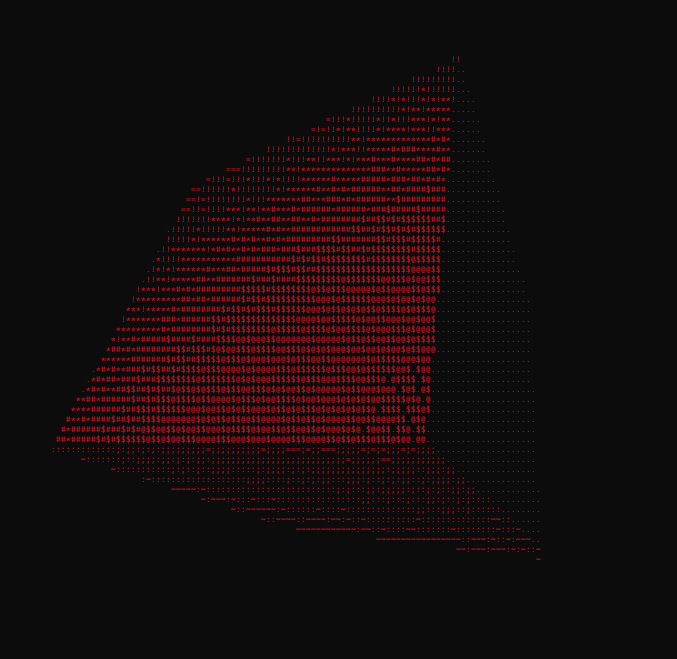

# ASCII 3D Rotating Cube



A lightweight, high-performance 3D rendering engine written in pure C. This project renders a rotating 3D cube directly into the terminal window using ASCII characters, featuring advanced lighting physics usually found in graphical game engines.

## 🚀 Features

Unlike simple ASCII animations, this project implements a full 3D pipeline from scratch:

* **Real-time 3D Projection:** Projects 3D coordinates onto a 2D terminal screen.

* **Z-Buffering:** Properly handles depth so faces behind the cube don't draw over front faces.

* **Advanced Lighting Engine:**
    * **Point Lighting:** Light source exists at a specific 3D coordinate, creating realistic gradients.

    * **Distance Attenuation:** Light gets dimmer the further it travels.

    * **Ambient Occlusion:** Prevents pitch-black shadows for a softer look.

* **Dithering:** Uses noise algorithms to smooth out the bands between ASCII characters.

* **Cross-Platform:** Runs natively on **Windows**, **Linux**, and **macOS**.

* **Dynamic Resizing:** Automatically detects terminal window size and scales the rendering buffers.

## 🛠️ Installation & Compilation

You need a C compiler (like `gcc`) to build this project.

### Linux / WSL / macOS
```bash
# Compile (Link with math library using -lm)
gcc cube.c -o cube -lm

# Run
./cube